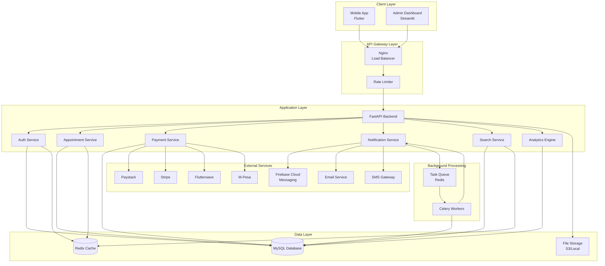
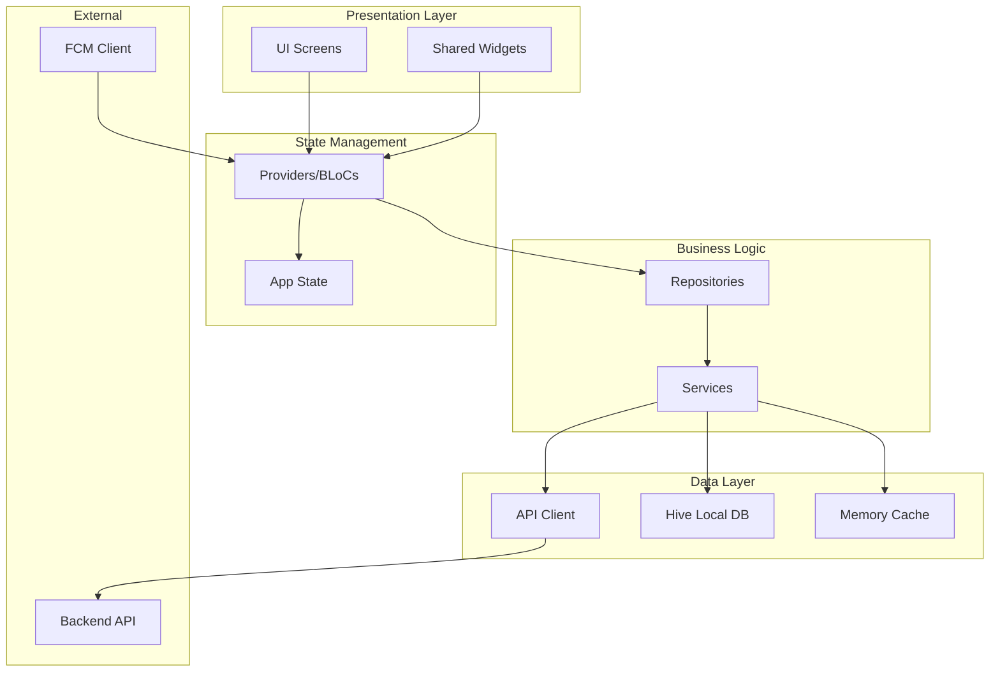
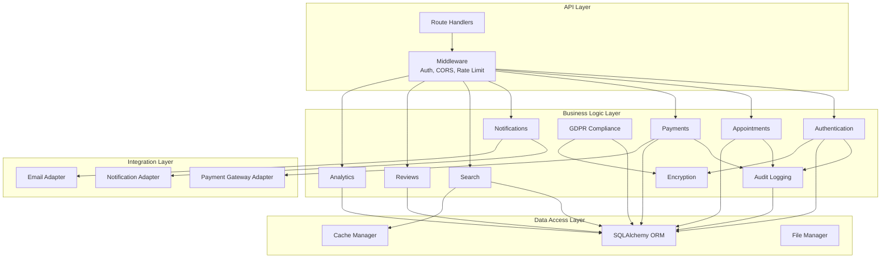
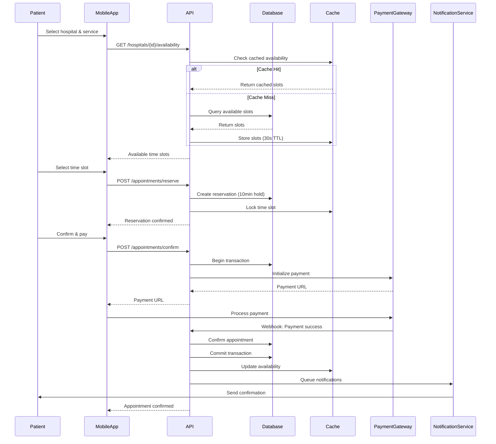
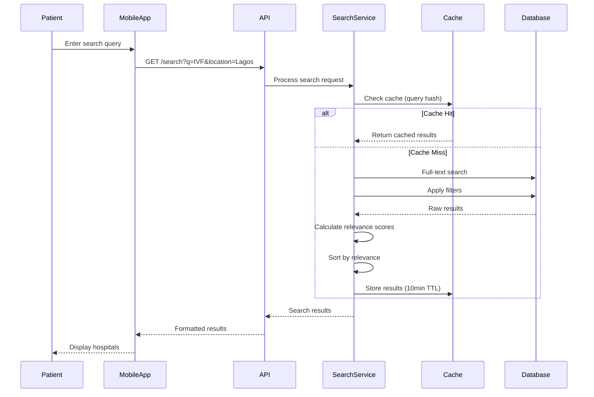
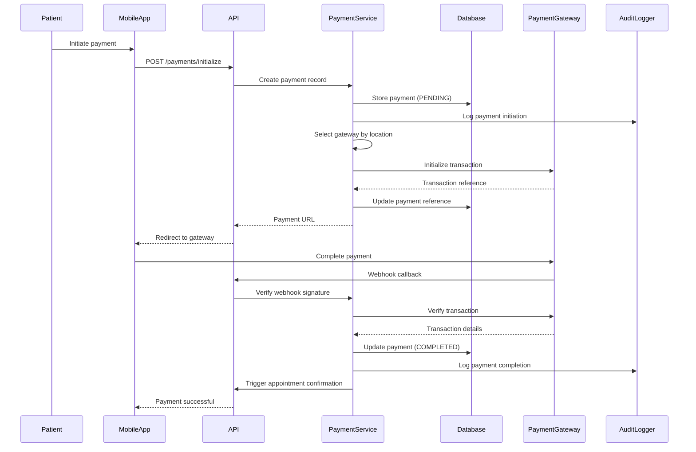

# Design Document: Fertility Services Platform Complete Development

## Overview

The Fertility Services Platform is a comprehensive healthcare technology solution connecting patients with fertility service providers across Africa. The platform consists of three primary components:

1. **Flutter Mobile Application** - Patient-facing mobile app for iOS and Android
2. **Python FastAPI Backend** - RESTful API server handling business logic and data management
3. **Streamlit Admin Dashboard** - Administrative interface for platform management

The platform facilitates appointment booking, service discovery, secure payments, real-time messaging, and comprehensive analytics while ensuring GDPR compliance and data security.

### Key Design Goals

- **Scalability**: Support 10,000+ concurrent users with sub-200ms response times
- **Security**: End-to-end encryption, PCI DSS compliance, and GDPR data protection
- **Reliability**: 99.9% uptime with automated failover and data backup
- **Extensibility**: Modular architecture supporting new features and payment gateways
- **User Experience**: Intuitive interfaces with offline support and real-time updates

### Technology Stack

**Backend:**
- Python 3.11+ with FastAPI framework
- MySQL 8.0 for relational data storage
- Redis 7.0 for caching and session management
- Celery for asynchronous task processing
- SQLAlchemy ORM for database abstraction

**Mobile App:**
- Flutter 3.27+ with Dart SDK
- Provider/Bloc for state management
- Hive for local offline storage
- Firebase Cloud Messaging for push notifications
- Dio/Retrofit for HTTP networking

**Admin Dashboard:**
- Streamlit for rapid UI development
- Plotly for interactive data visualizations
- Pandas for data analysis

**Infrastructure:**
- Docker containers for deployment
- Nginx as reverse proxy and load balancer
- AWS/Azure for cloud hosting
- GitHub Actions for CI/CD

**Payment Gateways:**
- Paystack (Primary - African markets)
- Stripe (International payments)
- Flutterwave (Alternative African provider)
- M-Pesa (Mobile money integration)

## Architecture

### High-Level System Architecture



### Component Architecture

#### 1. Mobile Application Architecture



#### 2. Backend Service Architecture



### Data Flow Diagrams

#### Appointment Booking Flow



#### Search and Filter Flow




#### Payment Processing Flow



## Components and Interfaces

### Backend API Components

#### 1. Authentication Service

**Responsibilities:**
- User registration and login
- JWT token generation and validation
- Password hashing and verification
- Session management
- Role-based access control (RBAC)

**Key Interfaces:**

```python
class AuthService:
    def register_user(email: str, password: str, user_type: UserType) -> User
    def authenticate(email: str, password: str) -> TokenPair
    def refresh_token(refresh_token: str) -> TokenPair
    def verify_token(token: str) -> User
    def reset_password(email: str) -> bool
    def change_password(user_id: int, old_password: str, new_password: str) -> bool
```

**Dependencies:**
- Database (User table)
- Redis (Session storage)
- Encryption Service (Password hashing)
- Email Service (Password reset)

#### 2. Appointment Service

**Responsibilities:**
- Appointment creation and management
- Time slot availability checking
- Appointment reservation with timeout
- Rescheduling and cancellation
- Reminder scheduling

**Key Interfaces:**

```python
class AppointmentService:
    def get_availability(hospital_id: int, date: datetime) -> List[TimeSlot]
    def reserve_slot(user_id: int, hospital_id: int, slot: TimeSlot) -> Reservation
    def confirm_appointment(reservation_id: int, payment_id: int) -> Appointment
    def reschedule_appointment(appointment_id: int, new_slot: TimeSlot) -> Appointment
    def cancel_appointment(appointment_id: int, reason: str) -> CancellationResult
    def get_user_appointments(user_id: int, status: AppointmentStatus) -> List[Appointment]
```

**Dependencies:**
- Database (Appointments, Services, Hospitals)
- Cache (Availability slots, Reservations)
- Payment Service (Refund processing)
- Notification Service (Reminders, confirmations)

#### 3. Payment Service

**Responsibilities:**
- Payment gateway integration
- Transaction processing
- Refund handling
- Split payment distribution
- Payment method management

**Key Interfaces:**

```python
class PaymentService:
    def initialize_payment(amount: Decimal, currency: str, user_id: int) -> PaymentIntent
    def verify_payment(reference: str) -> PaymentStatus
    def process_refund(payment_id: int, amount: Decimal, reason: str) -> Refund
    def get_payment_methods(user_id: int) -> List[PaymentMethod]
    def save_payment_method(user_id: int, token: str) -> PaymentMethod
    def process_split_payment(payment_id: int, splits: List[Split]) -> bool
```

**Payment Gateway Adapter Interface:**

```python
class PaymentGatewayAdapter(ABC):
    @abstractmethod
    def initialize_transaction(amount: Decimal, currency: str, metadata: dict) -> str
    
    @abstractmethod
    def verify_transaction(reference: str) -> TransactionResult
    
    @abstractmethod
    def process_refund(transaction_id: str, amount: Decimal) -> RefundResult
    
    @abstractmethod
    def validate_webhook(payload: dict, signature: str) -> bool
```

**Implementations:**
- PaystackAdapter
- StripeAdapter
- FlutterwaveAdapter
- MPesaAdapter

#### 4. Notification Service

**Responsibilities:**
- Multi-channel notification delivery (Push, Email, SMS)
- Notification templating
- Delivery retry logic
- User preference management
- Notification tracking and analytics

**Key Interfaces:**

```python
class NotificationService:
    def send_notification(user_id: int, notification: Notification) -> DeliveryResult
    def send_bulk_notifications(user_ids: List[int], notification: Notification) -> List[DeliveryResult]
    def schedule_notification(user_id: int, notification: Notification, send_at: datetime) -> str
    def get_user_preferences(user_id: int) -> NotificationPreferences
    def update_preferences(user_id: int, preferences: NotificationPreferences) -> bool
    def track_notification_event(notification_id: str, event: NotificationEvent) -> bool
```

**Notification Channels:**

```python
class NotificationChannel(ABC):
    @abstractmethod
    def send(recipient: str, message: Message) -> bool
    
    @abstractmethod
    def supports_rich_content() -> bool

class PushNotificationChannel(NotificationChannel):
    # FCM implementation
    
class EmailChannel(NotificationChannel):
    # SMTP/SendGrid implementation
    
class SMSChannel(NotificationChannel):
    # Twilio/Africa's Talking implementation
```

#### 5. Search Service

**Responsibilities:**
- Full-text search across hospitals, doctors, services
- Autocomplete suggestions
- Geolocation-based search
- Advanced filtering
- Search result ranking
- Search analytics

**Key Interfaces:**

```python
class SearchService:
    def search(query: str, filters: SearchFilters, pagination: Pagination) -> SearchResults
    def autocomplete(query: str, limit: int) -> List[Suggestion]
    def search_nearby(location: GeoPoint, radius_km: float, filters: SearchFilters) -> SearchResults
    def get_popular_searches(limit: int) -> List[str]
    def track_search(user_id: int, query: str, results_count: int) -> bool
```

**Search Filters:**

```python
@dataclass
class SearchFilters:
    service_types: Optional[List[str]]
    hospital_types: Optional[List[HospitalType]]
    price_range: Optional[Tuple[Decimal, Decimal]]
    rating_min: Optional[float]
    location: Optional[GeoPoint]
    radius_km: Optional[float]
    availability_date: Optional[datetime]
```

#### 6. Review Service

**Responsibilities:**
- Review submission and validation
- Rating calculation
- Content moderation
- Hospital response management
- Review reporting

**Key Interfaces:**

```python
class ReviewService:
    def submit_review(user_id: int, hospital_id: int, appointment_id: int, review: ReviewData) -> Review
    def get_hospital_reviews(hospital_id: int, filters: ReviewFilters, pagination: Pagination) -> List[Review]
    def calculate_hospital_rating(hospital_id: int) -> float
    def flag_review(review_id: int, reason: str) -> bool
    def respond_to_review(hospital_id: int, review_id: int, response: str) -> bool
    def moderate_review(admin_id: int, review_id: int, action: ModerationAction) -> bool
```

#### 7. Analytics Engine

**Responsibilities:**
- KPI calculation and tracking
- Report generation
- Cohort analysis
- Funnel analysis
- Data aggregation for privacy
- Scheduled report delivery

**Key Interfaces:**

```python
class AnalyticsEngine:
    def get_dashboard_metrics(date_range: DateRange) -> DashboardMetrics
    def generate_report(report_type: ReportType, parameters: dict) -> Report
    def get_cohort_analysis(cohort_definition: CohortDefinition) -> CohortAnalysis
    def get_funnel_analysis(funnel: FunnelDefinition) -> FunnelAnalysis
    def schedule_report(report_config: ReportConfig, schedule: Schedule) -> str
    def export_report(report_id: str, format: ExportFormat) -> bytes
```

#### 8. Audit Logger

**Responsibilities:**
- Comprehensive event logging
- Tamper-proof log storage
- Log search and filtering
- Compliance reporting
- Anomaly detection

**Key Interfaces:**

```python
class AuditLogger:
    def log_event(event: AuditEvent) -> bool
    def search_logs(filters: LogFilters, pagination: Pagination) -> List[AuditEvent]
    def export_logs(filters: LogFilters, format: ExportFormat) -> bytes
    def detect_anomalies(user_id: int, time_window: timedelta) -> List[Anomaly]
```

**Audit Event Structure:**

```python
@dataclass
class AuditEvent:
    timestamp: datetime
    user_id: Optional[int]
    action: str
    resource_type: str
    resource_id: Optional[int]
    ip_address: str
    user_agent: str
    request_id: str
    changes: Optional[dict]
    result: str  # success, failure, error
    error_message: Optional[str]
```

#### 9. Rate Limiter

**Responsibilities:**
- Request rate limiting per IP/user
- Sliding window algorithm
- Dynamic limit adjustment
- Rate limit violation logging
- Whitelist/blacklist management

**Key Interfaces:**

```python
class RateLimiter:
    def check_limit(identifier: str, endpoint: str) -> RateLimitResult
    def increment_counter(identifier: str, endpoint: str) -> int
    def get_limit_status(identifier: str, endpoint: str) -> LimitStatus
    def configure_limits(endpoint: str, limits: RateLimitConfig) -> bool
    def add_to_whitelist(identifier: str) -> bool
    def add_to_blacklist(identifier: str, duration: timedelta) -> bool
```

#### 10. Encryption Service

**Responsibilities:**
- Data encryption at rest
- TLS configuration
- Key management
- Key rotation
- Password hashing

**Key Interfaces:**

```python
class EncryptionService:
    def encrypt_field(data: str, key_category: KeyCategory) -> str
    def decrypt_field(encrypted_data: str, key_category: KeyCategory) -> str
    def hash_password(password: str) -> str
    def verify_password(password: str, hash: str) -> bool
    def rotate_keys(key_category: KeyCategory) -> bool
    def encrypt_file(file_path: str) -> str
```

#### 11. GDPR Compliance Module

**Responsibilities:**
- Consent management
- Data export (right to access)
- Data deletion/anonymization (right to be forgotten)
- Data portability
- Privacy notice management

**Key Interfaces:**

```python
class GDPRModule:
    def record_consent(user_id: int, purpose: str, version: str) -> Consent
    def withdraw_consent(user_id: int, purpose: str) -> bool
    def export_user_data(user_id: int) -> UserDataExport
    def anonymize_user_data(user_id: int) -> bool
    def get_data_processing_purposes() -> List[Purpose]
    def get_privacy_notice(version: str) -> PrivacyNotice
```

### Mobile App Components

#### 1. State Management Layer

**Provider/Bloc Architecture:**

```dart
// Authentication State
class AuthProvider extends ChangeNotifier {
  User? currentUser;
  AuthStatus status;
  
  Future<void> login(String email, String password);
  Future<void> register(UserRegistration data);
  Future<void> logout();
  Future<void> refreshToken();
}

// Appointment State
class AppointmentProvider extends ChangeNotifier {
  List<Appointment> appointments;
  AppointmentStatus filterStatus;
  
  Future<void> loadAppointments();
  Future<void> bookAppointment(AppointmentRequest request);
  Future<void> cancelAppointment(int appointmentId);
  Future<void> rescheduleAppointment(int appointmentId, DateTime newDate);
}

// Search State
class SearchProvider extends ChangeNotifier {
  String query;
  SearchFilters filters;
  List<Hospital> results;
  bool isLoading;
  
  Future<void> search(String query);
  void updateFilters(SearchFilters filters);
  Future<void> searchNearby(GeoPoint location);
}
```

#### 2. Repository Layer

**Data Access Abstraction:**

```dart
abstract class AppointmentRepository {
  Future<List<Appointment>> getUserAppointments(int userId);
  Future<Appointment> createAppointment(AppointmentRequest request);
  Future<Appointment> updateAppointment(int id, AppointmentUpdate update);
  Future<void> cancelAppointment(int id);
}

class AppointmentRepositoryImpl implements AppointmentRepository {
  final ApiClient apiClient;
  final LocalDatabase localDb;
  final CacheManager cache;
  
  // Implementation with offline support
}
```

#### 3. Service Layer

**Business Logic Services:**

```dart
class PaymentService {
  Future<PaymentIntent> initializePayment(Decimal amount, String currency);
  Future<PaymentResult> processPayment(PaymentIntent intent);
  Future<List<PaymentMethod>> getPaymentMethods();
}

class NotificationService {
  Future<void> registerDevice(String fcmToken);
  Future<void> handleNotification(RemoteMessage message);
  Future<void> updatePreferences(NotificationPreferences prefs);
}

class OfflineService {
  Future<void> syncPendingActions();
  Future<void> cacheData(String key, dynamic data);
  Future<dynamic> getCachedData(String key);
  bool isOnline();
}
```

### Admin Dashboard Components

#### Dashboard Modules

```python
class DashboardModule:
    def render_overview() -> None
    def render_user_management() -> None
    def render_hospital_management() -> None
    def render_appointment_management() -> None
    def render_payment_management() -> None
    def render_analytics() -> None
    def render_audit_logs() -> None
    def render_system_settings() -> None
```

## Data Models

### Core Database Schema

#### Users Table

```sql
CREATE TABLE users (
    id INT PRIMARY KEY AUTO_INCREMENT,
    email VARCHAR(255) UNIQUE NOT NULL,
    password_hash VARCHAR(255) NOT NULL,
    first_name VARCHAR(100) NOT NULL,
    last_name VARCHAR(100) NOT NULL,
    phone VARCHAR(20),
    date_of_birth DATETIME,
    gender VARCHAR(10),
    user_type ENUM('patient', 'sperm_donor', 'egg_donor', 'surrogate', 'hospital', 'admin') NOT NULL,
    is_active BOOLEAN DEFAULT TRUE,
    is_verified BOOLEAN DEFAULT FALSE,
    profile_completed BOOLEAN DEFAULT FALSE,
    profile_picture VARCHAR(255),
    bio TEXT,
    address TEXT,
    city VARCHAR(100),
    state VARCHAR(100),
    country VARCHAR(100),
    postal_code VARCHAR(20),
    latitude DECIMAL(10, 8),
    longitude DECIMAL(11, 8),
    wallet_balance DECIMAL(12, 2) DEFAULT 0.00,
    created_at DATETIME DEFAULT CURRENT_TIMESTAMP,
    updated_at DATETIME DEFAULT CURRENT_TIMESTAMP ON UPDATE CURRENT_TIMESTAMP,
    INDEX idx_email (email),
    INDEX idx_user_type (user_type),
    INDEX idx_location (latitude, longitude)
);
```

#### Hospitals Table

```sql
CREATE TABLE hospitals (
    id INT PRIMARY KEY AUTO_INCREMENT,
    user_id INT,
    name VARCHAR(255) NOT NULL,
    license_number VARCHAR(100) UNIQUE,
    hospital_type ENUM('IVF Centers', 'Fertility Clinics', 'Sperm Banks', 'Surrogacy Centers', 'General Hospital') DEFAULT 'General Hospital',
    address TEXT NOT NULL,
    city VARCHAR(100) NOT NULL,
    state VARCHAR(100) NOT NULL,
    country VARCHAR(100) NOT NULL,
    zip_code VARCHAR(20),
    phone VARCHAR(20),
    email VARCHAR(255),
    website VARCHAR(255),
    description TEXT,
    services_offered JSON,
    is_verified BOOLEAN DEFAULT FALSE,
    rating DECIMAL(3, 2) DEFAULT 0.00,
    total_reviews INT DEFAULT 0,
    created_at DATETIME DEFAULT CURRENT_TIMESTAMP,
    updated_at DATETIME DEFAULT CURRENT_TIMESTAMP ON UPDATE CURRENT_TIMESTAMP,
    FOREIGN KEY (user_id) REFERENCES users(id),
    INDEX idx_hospital_type (hospital_type),
    INDEX idx_location (city, state, country),
    INDEX idx_rating (rating),
    FULLTEXT idx_search (name, description)
);
```

#### Services Table

```sql
CREATE TABLE services (
    id INT PRIMARY KEY AUTO_INCREMENT,
    hospital_id INT,
    name VARCHAR(255) NOT NULL,
    description TEXT,
    price DECIMAL(10, 2) NOT NULL DEFAULT 0.00,
    duration_minutes INT DEFAULT 60,
    is_active BOOLEAN DEFAULT TRUE,
    is_featured BOOLEAN DEFAULT FALSE,
    service_type VARCHAR(50),
    category ENUM('IVF', 'IUI', 'Fertility_Testing', 'Consultation', 'Egg_Freezing', 'Other') NOT NULL,
    view_count INT DEFAULT 0,
    booking_count INT DEFAULT 0,
    created_at DATETIME DEFAULT CURRENT_TIMESTAMP,
    updated_at DATETIME DEFAULT CURRENT_TIMESTAMP ON UPDATE CURRENT_TIMESTAMP,
    FOREIGN KEY (hospital_id) REFERENCES hospitals(id),
    INDEX idx_hospital (hospital_id),
    INDEX idx_category (category),
    INDEX idx_featured (is_featured),
    INDEX idx_price (price),
    FULLTEXT idx_search (name, description)
);
```


#### Appointments Table

```sql
CREATE TABLE appointments (
    id INT PRIMARY KEY AUTO_INCREMENT,
    user_id INT NOT NULL,
    hospital_id INT NOT NULL,
    service_id INT NOT NULL,
    appointment_date DATETIME NOT NULL,
    status ENUM('pending', 'confirmed', 'completed', 'cancelled') DEFAULT 'pending',
    notes TEXT,
    price DECIMAL(10, 2),
    cancellation_reason TEXT,
    cancelled_at DATETIME,
    reserved_until DATETIME,  -- For 10-minute reservation hold
    created_at DATETIME DEFAULT CURRENT_TIMESTAMP,
    updated_at DATETIME DEFAULT CURRENT_TIMESTAMP ON UPDATE CURRENT_TIMESTAMP,
    FOREIGN KEY (user_id) REFERENCES users(id),
    FOREIGN KEY (hospital_id) REFERENCES hospitals(id),
    FOREIGN KEY (service_id) REFERENCES services(id),
    INDEX idx_user (user_id),
    INDEX idx_hospital (hospital_id),
    INDEX idx_date (appointment_date),
    INDEX idx_status (status),
    INDEX idx_reserved (reserved_until)
);
```

#### Payments Table

```sql
CREATE TABLE payments (
    id INT PRIMARY KEY AUTO_INCREMENT,
    user_id INT NOT NULL,
    appointment_id INT,
    amount DECIMAL(10, 2) NOT NULL,
    currency VARCHAR(3) DEFAULT 'NGN',
    payment_gateway ENUM('paystack', 'stripe', 'flutterwave', 'mpesa', 'manual') DEFAULT 'paystack',
    payment_method VARCHAR(50),
    transaction_id VARCHAR(255) UNIQUE,
    gateway_reference VARCHAR(255),
    gateway_transaction_id VARCHAR(255),
    authorization_code VARCHAR(255),
    status ENUM('pending', 'completed', 'failed', 'refunded', 'cancelled') DEFAULT 'pending',
    gateway_response JSON,
    payment_date DATETIME,
    refund_amount DECIMAL(10, 2),
    refund_date DATETIME,
    refund_reason TEXT,
    created_at DATETIME DEFAULT CURRENT_TIMESTAMP,
    updated_at DATETIME DEFAULT CURRENT_TIMESTAMP ON UPDATE CURRENT_TIMESTAMP,
    FOREIGN KEY (user_id) REFERENCES users(id),
    FOREIGN KEY (appointment_id) REFERENCES appointments(id),
    INDEX idx_user (user_id),
    INDEX idx_appointment (appointment_id),
    INDEX idx_transaction (transaction_id),
    INDEX idx_status (status),
    INDEX idx_gateway (payment_gateway)
);
```

#### Reviews Table

```sql
CREATE TABLE reviews (
    id INT PRIMARY KEY AUTO_INCREMENT,
    user_id INT NOT NULL,
    hospital_id INT NOT NULL,
    appointment_id INT NOT NULL,
    rating INT NOT NULL CHECK (rating BETWEEN 1 AND 5),
    comment TEXT,
    is_flagged BOOLEAN DEFAULT FALSE,
    flag_count INT DEFAULT 0,
    is_hidden BOOLEAN DEFAULT FALSE,
    hospital_response TEXT,
    hospital_response_date DATETIME,
    is_immutable BOOLEAN DEFAULT FALSE,
    immutable_after DATETIME,  -- 48 hours after creation
    created_at DATETIME DEFAULT CURRENT_TIMESTAMP,
    updated_at DATETIME DEFAULT CURRENT_TIMESTAMP ON UPDATE CURRENT_TIMESTAMP,
    FOREIGN KEY (user_id) REFERENCES users(id),
    FOREIGN KEY (hospital_id) REFERENCES hospitals(id),
    FOREIGN KEY (appointment_id) REFERENCES appointments(id),
    UNIQUE KEY unique_review (user_id, appointment_id),
    INDEX idx_hospital (hospital_id),
    INDEX idx_rating (rating),
    INDEX idx_flagged (is_flagged)
);
```

#### Notifications Table

```sql
CREATE TABLE notifications (
    id INT PRIMARY KEY AUTO_INCREMENT,
    user_id INT NOT NULL,
    title VARCHAR(255) NOT NULL,
    message TEXT NOT NULL,
    notification_type VARCHAR(50),
    channel ENUM('push', 'email', 'sms') NOT NULL,
    status ENUM('pending', 'sent', 'failed', 'delivered', 'read') DEFAULT 'pending',
    retry_count INT DEFAULT 0,
    scheduled_at DATETIME,
    sent_at DATETIME,
    delivered_at DATETIME,
    read_at DATETIME,
    error_message TEXT,
    metadata JSON,
    created_at DATETIME DEFAULT CURRENT_TIMESTAMP,
    FOREIGN KEY (user_id) REFERENCES users(id),
    INDEX idx_user (user_id),
    INDEX idx_status (status),
    INDEX idx_scheduled (scheduled_at),
    INDEX idx_type (notification_type)
);
```

#### Audit Logs Table

```sql
CREATE TABLE audit_logs (
    id BIGINT PRIMARY KEY AUTO_INCREMENT,
    timestamp DATETIME NOT NULL DEFAULT CURRENT_TIMESTAMP,
    user_id INT,
    action VARCHAR(100) NOT NULL,
    resource_type VARCHAR(50) NOT NULL,
    resource_id INT,
    ip_address VARCHAR(45),
    user_agent TEXT,
    request_id VARCHAR(100),
    changes JSON,
    result VARCHAR(20) NOT NULL,
    error_message TEXT,
    created_at DATETIME DEFAULT CURRENT_TIMESTAMP,
    FOREIGN KEY (user_id) REFERENCES users(id),
    INDEX idx_user (user_id),
    INDEX idx_timestamp (timestamp),
    INDEX idx_action (action),
    INDEX idx_resource (resource_type, resource_id)
);
```

#### GDPR Consents Table

```sql
CREATE TABLE gdpr_consents (
    id INT PRIMARY KEY AUTO_INCREMENT,
    user_id INT NOT NULL,
    purpose VARCHAR(100) NOT NULL,
    consent_given BOOLEAN NOT NULL,
    consent_version VARCHAR(20) NOT NULL,
    ip_address VARCHAR(45),
    user_agent TEXT,
    withdrawn_at DATETIME,
    created_at DATETIME DEFAULT CURRENT_TIMESTAMP,
    updated_at DATETIME DEFAULT CURRENT_TIMESTAMP ON UPDATE CURRENT_TIMESTAMP,
    FOREIGN KEY (user_id) REFERENCES users(id),
    INDEX idx_user (user_id),
    INDEX idx_purpose (purpose)
);
```

#### Rate Limit Counters (Redis)

```python
# Redis key structure for rate limiting
# Key: rate_limit:{identifier}:{endpoint}:{window}
# Value: counter (integer)
# TTL: window duration

# Example:
# rate_limit:192.168.1.1:/api/v1/auth/login:1704067200 = 5
# TTL: 60 seconds
```

#### Cache Keys (Redis)

```python
# Hospital availability cache
# Key: availability:{hospital_id}:{date}
# Value: JSON array of time slots
# TTL: 30 seconds

# Search results cache
# Key: search:{query_hash}
# Value: JSON search results
# TTL: 10 minutes

# User session cache
# Key: session:{user_id}
# Value: JSON session data
# TTL: 24 hours
```

### API Endpoint Specifications

#### Authentication Endpoints

```
POST /api/v1/auth/register
Request:
{
  "email": "patient@example.com",
  "password": "SecurePass123!",
  "first_name": "John",
  "last_name": "Doe",
  "user_type": "patient",
  "phone": "+234801234567"
}
Response: 201 Created
{
  "user": {
    "id": 1,
    "email": "patient@example.com",
    "first_name": "John",
    "last_name": "Doe",
    "user_type": "patient"
  },
  "tokens": {
    "access_token": "eyJ...",
    "refresh_token": "eyJ...",
    "token_type": "bearer",
    "expires_in": 3600
  }
}

POST /api/v1/auth/login
Request:
{
  "email": "patient@example.com",
  "password": "SecurePass123!"
}
Response: 200 OK
{
  "user": {...},
  "tokens": {...}
}

POST /api/v1/auth/refresh
Request:
{
  "refresh_token": "eyJ..."
}
Response: 200 OK
{
  "access_token": "eyJ...",
  "expires_in": 3600
}

POST /api/v1/auth/logout
Headers: Authorization: Bearer {token}
Response: 204 No Content
```

#### Hospital Endpoints

```
GET /api/v1/hospitals
Query Parameters:
  - page: int (default: 1)
  - limit: int (default: 20, max: 50)
  - hospital_type: HospitalType
  - city: string
  - rating_min: float
  - sort_by: string (rating, distance, name)
Response: 200 OK
{
  "hospitals": [...],
  "pagination": {
    "page": 1,
    "limit": 20,
    "total": 150,
    "pages": 8
  }
}

GET /api/v1/hospitals/{id}
Response: 200 OK
{
  "id": 1,
  "name": "Lagos Fertility Center",
  "hospital_type": "IVF Centers",
  "rating": 4.5,
  "total_reviews": 120,
  "services": [...],
  "location": {...}
}

GET /api/v1/hospitals/{id}/availability
Query Parameters:
  - date: date (YYYY-MM-DD)
  - service_id: int
Response: 200 OK
{
  "date": "2024-01-15",
  "slots": [
    {
      "time": "09:00",
      "available": true,
      "duration_minutes": 60
    },
    ...
  ]
}

POST /api/v1/hospitals
Headers: Authorization: Bearer {admin_token}
Request:
{
  "name": "New Fertility Clinic",
  "hospital_type": "Fertility Clinics",
  "address": "123 Main St",
  "city": "Lagos",
  "state": "Lagos",
  "country": "Nigeria",
  ...
}
Response: 201 Created
```

#### Service Endpoints

```
GET /api/v1/services
Query Parameters:
  - hospital_id: int
  - category: ServiceCategory
  - price_min: decimal
  - price_max: decimal
  - is_featured: boolean
Response: 200 OK
{
  "services": [
    {
      "id": 1,
      "name": "IVF Treatment",
      "category": "IVF",
      "price": 500000.00,
      "currency": "NGN",
      "duration_minutes": 120,
      "hospital": {...}
    },
    ...
  ]
}

POST /api/v1/services
Headers: Authorization: Bearer {hospital_token}
Request:
{
  "name": "Fertility Consultation",
  "description": "Initial consultation with fertility specialist",
  "price": 25000.00,
  "duration_minutes": 60,
  "category": "Consultation"
}
Response: 201 Created

PUT /api/v1/services/{id}
DELETE /api/v1/services/{id}
```

#### Appointment Endpoints

```
POST /api/v1/appointments/reserve
Headers: Authorization: Bearer {token}
Request:
{
  "hospital_id": 1,
  "service_id": 5,
  "appointment_date": "2024-01-15T09:00:00Z"
}
Response: 201 Created
{
  "reservation_id": "res_abc123",
  "expires_at": "2024-01-14T10:10:00Z",
  "appointment": {...}
}

POST /api/v1/appointments/confirm
Request:
{
  "reservation_id": "res_abc123",
  "payment_method": "paystack"
}
Response: 200 OK
{
  "appointment": {...},
  "payment": {
    "payment_url": "https://checkout.paystack.com/...",
    "reference": "pay_xyz789"
  }
}

GET /api/v1/appointments
Query Parameters:
  - status: AppointmentStatus
  - date_from: date
  - date_to: date
Response: 200 OK
{
  "appointments": [...]
}

PUT /api/v1/appointments/{id}/reschedule
Request:
{
  "new_date": "2024-01-20T14:00:00Z"
}
Response: 200 OK

DELETE /api/v1/appointments/{id}
Request:
{
  "reason": "Personal emergency"
}
Response: 200 OK
{
  "refund": {
    "amount": 250000.00,
    "percentage": 50,
    "status": "processing"
  }
}
```

#### Payment Endpoints

```
POST /api/v1/payments/initialize
Request:
{
  "amount": 500000.00,
  "currency": "NGN",
  "appointment_id": 123,
  "payment_gateway": "paystack"
}
Response: 200 OK
{
  "payment_id": 456,
  "payment_url": "https://checkout.paystack.com/...",
  "reference": "pay_xyz789"
}

POST /api/v1/payments/webhook/paystack
Headers: X-Paystack-Signature: {signature}
Request: {Paystack webhook payload}
Response: 200 OK

GET /api/v1/payments/{id}/verify
Response: 200 OK
{
  "payment": {
    "id": 456,
    "status": "completed",
    "amount": 500000.00,
    "transaction_id": "trx_123456"
  }
}

POST /api/v1/payments/{id}/refund
Request:
{
  "amount": 250000.00,
  "reason": "Appointment cancelled"
}
Response: 200 OK
```

#### Search Endpoints

```
GET /api/v1/search
Query Parameters:
  - q: string (search query)
  - type: string (hospitals, services, doctors)
  - location: string
  - latitude: float
  - longitude: float
  - radius_km: float
  - price_min: decimal
  - price_max: decimal
  - rating_min: float
  - category: ServiceCategory
  - sort_by: string
Response: 200 OK
{
  "query": "IVF treatment Lagos",
  "results": [
    {
      "type": "hospital",
      "id": 1,
      "name": "Lagos Fertility Center",
      "relevance_score": 0.95,
      "distance_km": 2.5,
      ...
    },
    ...
  ],
  "suggestions": ["IVF centers in Lagos", "IVF treatment cost"],
  "total": 45
}

GET /api/v1/search/autocomplete
Query Parameters:
  - q: string (minimum 3 characters)
  - limit: int (default: 10)
Response: 200 OK
{
  "suggestions": [
    "IVF treatment",
    "IVF centers Lagos",
    "IVF cost Nigeria"
  ]
}
```

#### Review Endpoints

```
POST /api/v1/reviews
Headers: Authorization: Bearer {token}
Request:
{
  "hospital_id": 1,
  "appointment_id": 123,
  "rating": 5,
  "comment": "Excellent service and professional staff"
}
Response: 201 Created

GET /api/v1/reviews
Query Parameters:
  - hospital_id: int
  - rating: int
  - date_from: date
  - date_to: date
Response: 200 OK
{
  "reviews": [...],
  "average_rating": 4.5,
  "rating_distribution": {
    "5": 60,
    "4": 30,
    "3": 8,
    "2": 1,
    "1": 1
  }
}

POST /api/v1/reviews/{id}/flag
Request:
{
  "reason": "Inappropriate content"
}
Response: 200 OK

POST /api/v1/reviews/{id}/respond
Headers: Authorization: Bearer {hospital_token}
Request:
{
  "response": "Thank you for your feedback..."
}
Response: 200 OK
```

#### Notification Endpoints

```
GET /api/v1/notifications
Headers: Authorization: Bearer {token}
Response: 200 OK
{
  "notifications": [
    {
      "id": 1,
      "title": "Appointment Reminder",
      "message": "Your appointment is tomorrow at 9:00 AM",
      "type": "appointment_reminder",
      "is_read": false,
      "created_at": "2024-01-14T10:00:00Z"
    },
    ...
  ],
  "unread_count": 5
}

PUT /api/v1/notifications/{id}/read
Response: 200 OK

GET /api/v1/notifications/preferences
Response: 200 OK
{
  "push_enabled": true,
  "email_enabled": true,
  "sms_enabled": false,
  "preferences": {
    "appointment_reminders": true,
    "marketing": false,
    "messages": true
  }
}

PUT /api/v1/notifications/preferences
Request: {preferences object}
Response: 200 OK
```

#### Analytics Endpoints (Admin)

```
GET /api/v1/admin/analytics/dashboard
Headers: Authorization: Bearer {admin_token}
Query Parameters:
  - date_from: date
  - date_to: date
Response: 200 OK
{
  "metrics": {
    "total_users": 10500,
    "new_users": 250,
    "total_appointments": 3200,
    "completed_appointments": 2800,
    "total_revenue": 45000000.00,
    "average_rating": 4.3
  },
  "charts": {
    "user_growth": [...],
    "revenue_trend": [...],
    "appointment_status": {...}
  }
}

POST /api/v1/admin/analytics/reports
Request:
{
  "report_type": "revenue",
  "date_from": "2024-01-01",
  "date_to": "2024-01-31",
  "format": "pdf"
}
Response: 200 OK
{
  "report_id": "rep_abc123",
  "status": "generating"
}

GET /api/v1/admin/analytics/reports/{id}
Response: 200 OK (returns file)
```

#### GDPR Endpoints

```
POST /api/v1/gdpr/consent
Headers: Authorization: Bearer {token}
Request:
{
  "purpose": "marketing",
  "consent_given": true,
  "version": "1.0"
}
Response: 200 OK

GET /api/v1/gdpr/export
Response: 202 Accepted
{
  "export_id": "exp_abc123",
  "status": "processing",
  "estimated_completion": "2024-01-15T10:00:00Z"
}

GET /api/v1/gdpr/export/{id}
Response: 200 OK (returns JSON file)

DELETE /api/v1/gdpr/delete-account
Request:
{
  "confirmation": "DELETE MY ACCOUNT",
  "reason": "No longer need the service"
}
Response: 202 Accepted
{
  "deletion_id": "del_abc123",
  "scheduled_for": "2024-02-14T00:00:00Z"
}
```

